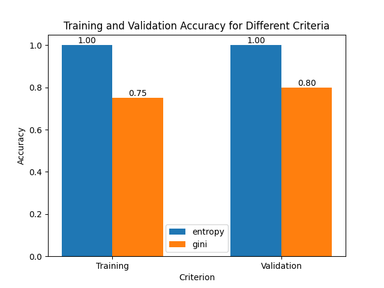
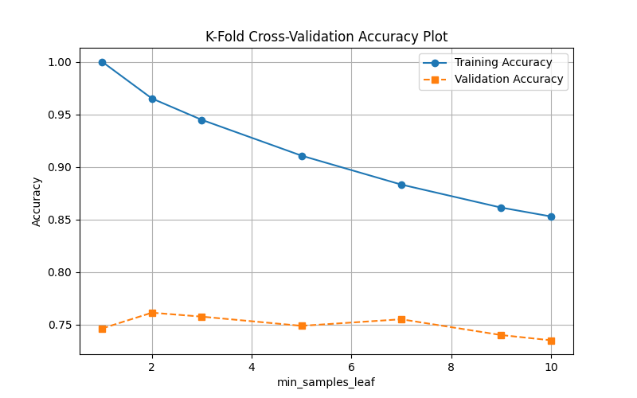
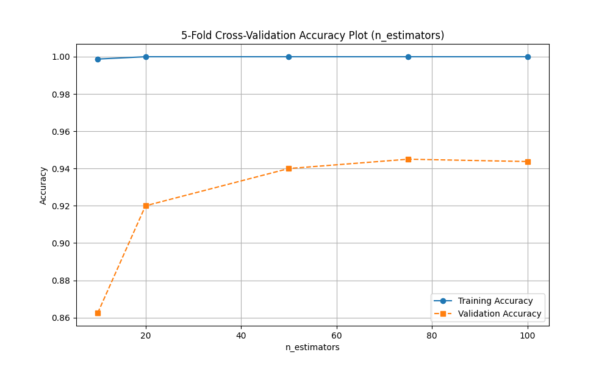
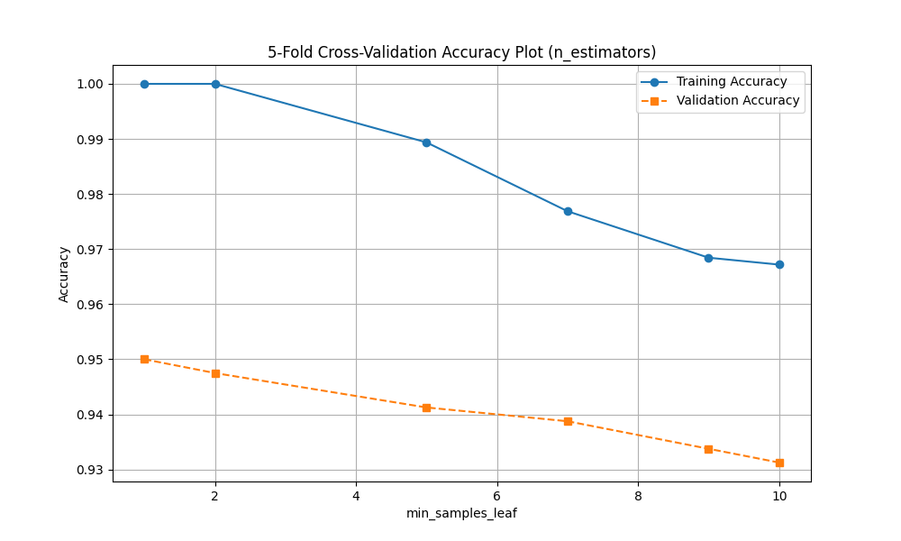

# Document Classification using Tree-Based Models
### By Mayank Vyas (1233250371)
## Project Overview
This project focuses on classifying news articles into five categories: **sport, business, politics, entertainment, and tech**. The classification is performed using tree-based models, including **Decision Tree, Random Forest, and AdaBoost**, with hyperparameter tuning to achieve optimal performance.

The key steps in this process include:
- **Data Preprocessing**
- **Training a Decision Tree Model**
- **Hyperparameter Tuning with Cross-Validation**
- **Training and Evaluating Random Forest and AdaBoost Models**
- **Making Predictions on Test Data**

## Dataset Description
The dataset consists of news articles, each labeled with one of five categories.

- **Training Data:** Contains 1000 labeled articles (`ArticleId`, `Text`, `Category`).
- **Test Data:** Contains 681 articles (`ArticleId`, `Text`) without labels.

---

##  Question 1 Data Preprocessing
Before training the models, the raw text data is preprocessed as follows:

1. **Lowercasing**: Convert all text to lowercase.
2. **Tokenization**: Splitting text into individual words.
3. **Stopword Removal**: Removing common words that do not contribute to classification.
4. **Lemmatization**: Converting words to their base form.
5. **TF-IDF Vectorization**: Transforming text into numerical features.

---

##  Question 2  Decision Tree Model Evaluation
### **Hyperparameter Tuning**

#### 1. Criterion (`gini` vs. `entropy`)
A decision tree classifier was trained with different `criterion` values.

**Results:**

| Criterion | Training Accuracy | Validation Accuracy |
|-----------|------------------|---------------------|
| Gini      | **75%**          | **80%**            |
| Entropy   | **100%**          | **100%**            |

*(Figure below shows the comparison of accuracy for different criteria.)*



#### 2. Minimum Samples per Leaf (`min_samples_leaf`)
A 5-fold cross-validation was conducted for different values of `min_samples_leaf`.

**Results:**

| min_samples_leaf | Training Accuracy | Validation Accuracy |
|-----------------|------------------|---------------------|
| 1             | **100%**          | **74.62%**            |
| 2             | **96.5%**          | **76.125%**            |
| 3            | **94.4%**          | **75.75%**            |
| 5            | **91.01%**          | **74.87%**            |
| 7            | **88.31%**          | **75.50%**            |
| 9            | **86.12%**          | **74.00%**            |
| 10            | **85.28%**          | **73.50%**            |

*(Line plot showing training and validation accuracy with varying `min_samples_leaf` values:)*



#### 3. Maximum Features (`max_features`)
The model was trained with varying `max_features` values.

**Results:**

| max_features | Training Accuracy | Validation Accuracy |
|--------------|-------------------|---------------------|
| 2            | **100%**        | **52.12%**          |
| 4            | **100%**        | **55.25%**          |
| 6            | **100%**        | **53.00%**          |
| 8            | **100%**        | **53.87%**          |
| 10           | **100%**        | **51.87%**          |
| NaN          | **100%**        | **74.62%**          |

---

## Question 3 Random Forest Model Evaluation
### **Hyperparameter Tuning**

#### 1. Number of Estimators (`n_estimators`)
The impact of increasing the number of trees was analyzed.

**Results:**

| n_estimators | Training Accuracy | Validation Accuracy |
|--------------|-------------------|---------------------|
| 10           | **99.87%**         | **86.25%**           |
| 20           | **100%**         | **92.00%**           |
| 50           | **100%**         | **94.00%**           |
| 75           | **100%**         | **94.50%**           |
| 100          | **100%**         | **94.37%**           |



#### 2. Minimum Samples per Leaf (`min_samples_leaf`)
Cross-validation results:

| min_samples_leaf | Training Accuracy | Validation Accuracy |
|------------------|-------------------|---------------------|
| 1                | **100%**          | **95.00%**          |
| 2                | **100%**        | **94.75%**          |
| 5                | **98.93%**        | **94.12%**          |
| 7                | **97.67%**        | **93.87%**          |
| 9                | **96.84%**        | **93.37%**          |
| 10               | **95.71%**        | **93.12%**          |

*(Line plot for Random Forest min_samples_leaf tuning:)*



---

<!-- ## AdaBoost Model Evaluation
### **Hyperparameter Tuning**

Boosting was used to improve classification performance. The number of estimators was varied.

| n_estimators | Training Accuracy | Validation Accuracy |
|-------------|------------------|---------------------|
| 10          | **XX%**          | **XX%**            |
| 50          | **XX%**          | **XX%**            |


--- -->

## Question 4 **Final Model Selection and Prediction**
After evaluating all models, the best hyperparameters were chosen based on validation accuracy. The final model was trained on the entire training dataset and used to make predictions on the test set.

- **Final Model:** *[Chosen model and best parameters]*
- **Test Set Predictions:** Labels were generated and stored in `labels.csv` as required.

Example format of `labels.csv`:
```
ArticleId,Category
1,sports
2,politics
...
```

---

## **Submission Files**
The following files were submitted:
1. **`code.ipynb`** - Jupyter Notebook containing all implementation steps.
2. **`description.pdf`** - Explanation of model selection and results.
3. **`labels.csv`** - Final predictions for test data.

---

## **Conclusion**
This project implemented Decision Trees, Random Forest, and AdaBoost for news classification. The best-performing model was selected based on hyperparameter tuning and cross-validation. The final predictions were submitted for evaluation.

