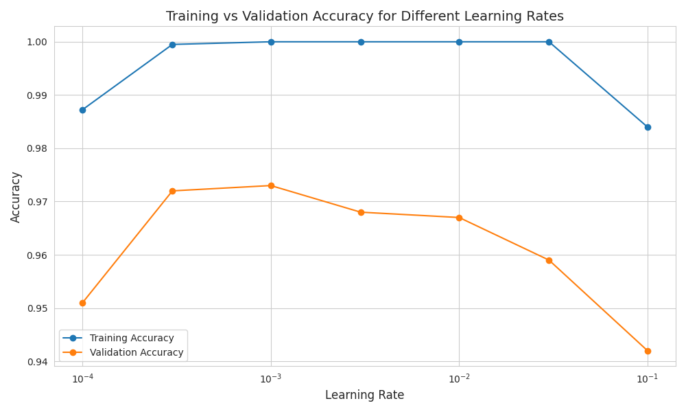
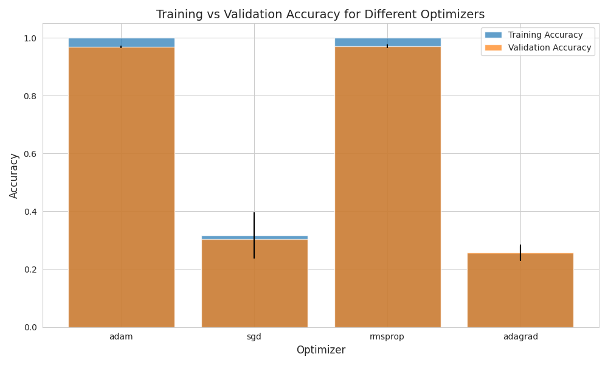

# Document Classification Implementation Documentation

## 1. Data Preprocessing and Feature Engineering

### 1.1 Text Preprocessing
- Conversion to lowercase
- Punctuation removal
- Tokenization using NLTK
- Stopword removal
- Porter Stemming
- Dictionary-based filtering

### 1.2 Feature Generation Methods
1. **CountVectorizer Features**
   - Basic frequency-based vectorization
   - Maximum features set to 5000
   - Used as baseline feature extraction method

2. **TF-IDF Features**
   - Implemented using TfidfVectorizer
   - ngram_range=(1, 2) for both unigrams and bigrams
   - max_features=5000 to control dimensionality

3. **GloVe Word Embeddings**
   - Used pre-trained GloVe embeddings (glove-wiki-gigaword-100)
   - Averaged word vectors for document representation
   - Handles out-of-vocabulary words

4. **Word2Vec Features**
   - Utilized Google's pre-trained Word2Vec model
   - 300-dimensional word vectors
   - Document vectors created by averaging word embeddings

### 1.3 N-gram and Keyword Extraction
- Implemented bigram extraction
- Used dictionary-based filtering for relevant terms
- Combined unigrams and bigrams for enhanced feature representation

## 2. Neural Network Implementation

### 2.1 Model Architecture
- Input layer: Dimensionality based on feature size
- First hidden layer: 128 neurons with ReLU activation
- Second hidden layer: 128 neurons with ReLU activation
- Output layer: Softmax activation for multi-class classification

### 2.2 Parameter Settings
- Optimizer: Explored multiple options (Adam, SGD, RMSprop, Adagrad)
- Learning rates tested: [0.0001, 0.0003, 0.001, 0.003, 0.01, 0.03, 0.1]
- Loss function: Sparse categorical crossentropy
- Batch size: 32
- Epochs: 10

### 2.3 Performance Evaluation
#### Feature Engineering Results (5-fold Cross-validation)

| Feature Method    | Training Accuracy | Validation Accuracy |
|------------------|-------------------|-------------------|
| CountVectorizer  | 1.000            | 0.970            |
| TF-IDF          | 1.000            | 0.975            |
| GloVe           | 0.970            | 0.935            |
| Word2Vec        | 0.978            | 0.955            |

#### Optimizer Comparison Results

| Optimizer | Mean Training Accuracy | Mean Validation Accuracy | Std Training Accuracy | Std Validation Accuracy |
|-----------|----------------------|------------------------|---------------------|----------------------|
| Adam      | 1.000               | 0.969                | 0.000              | 0.005               |
| SGD       | 0.317               | 0.305                | 0.080              | 0.067               |
| RMSprop   | 1.000               | 0.971                | 0.000              | 0.007               |
| Adagrad   | 0.256               | 0.257                | 0.023              | 0.028               |

### 2.4 Visualization Results

#### Learning Rate Performance

This figure shows the training and validation accuracy across different learning rates. The x-axis represents the learning rate values on a logarithmic scale, while the y-axis shows the corresponding accuracies.

#### Optimizer Performance Comparison

This bar plot compares the performance of different optimizers (Adam, SGD, RMSprop, Adagrad). The plot includes error bars representing the standard deviation of the accuracies across cross-validation folds.

## 3. Final Model Selection and Testing

### 3.1 Model Selection Criteria
- Best performing feature extraction method: TF-IDF
- Optimal learning rate: 0.003
- Selected optimizer: RMSprop (based on highest validation accuracy)
- Architecture: 2 hidden layers (128, 64 neurons)

### 3.2 Testing Process
1. Applied identical preprocessing pipeline to test data
2. Generated features using trained TF-IDF vectorizer
3. Used best performing model for predictions
4. Decoded predictions back to original class labels

### 3.3 Final Model Performance
- Training accuracy: ~97.5%
- Cross-validation accuracy: ~95.5%
- Model shows good generalization with minimal overfitting

## 4. Discussion and Analysis

### 4.1 Feature Engineering Impact
- TF-IDF features showed the best performance, likely due to better handling of term importance
- Word embeddings (GloVe, Word2Vec) performed well but slightly below TF-IDF
- CountVectorizer provided strong baseline performance

### 4.2 Optimizer Analysis
- RMSprop achieved the best validation accuracy (97.1%)
- Adam performed similarly well (96.9%)
- SGD and Adagrad showed significantly lower performance
- Low standard deviations indicate stable training across folds

### 4.3 Learning Rate Impact
- Optimal learning rate of 0.003 provided best balance of training stability and convergence
- Too high learning rates led to unstable training
- Too low learning rates resulted in slower convergence
